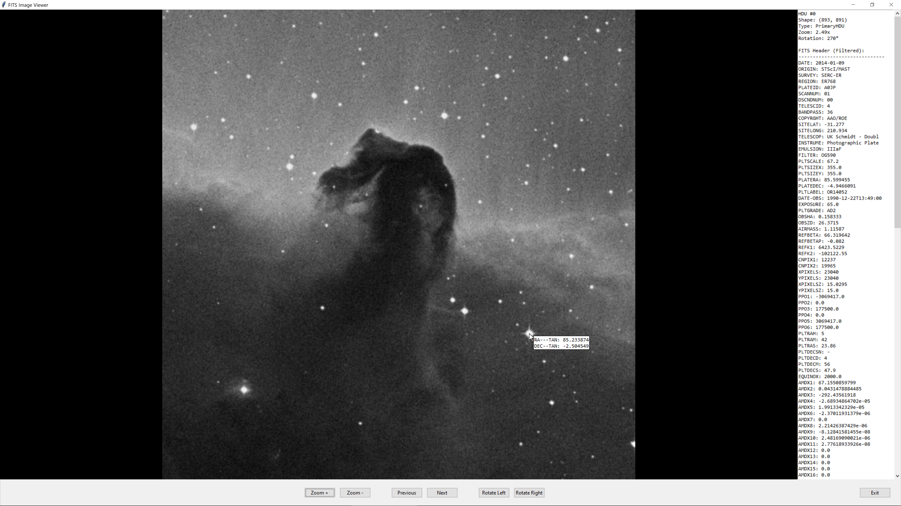

# FITS Viewer

A lightweight tool for viewing and navigating FITS (Flexible Image Transport System) files, built with Python and Tkinter. This tool dynamically loads and displays tabular data and images from FITS files, especially suited for large datasets like `specObj-dr17.fits` from the SDSS.

## Features

- **Dynamic Loading**: Columns are automatically loaded from HDU 1 of the FITS file for tabular display, with no hardcoded columns in the code.
- **Table Navigation**: Navigate through tabular data using Previous/Next buttons or mousewheel for page up/down.
- **Jump to Page**: Jump to any page for quick navigation in large datasets.
- **Customization**: Adjust font size, column width, number of rows, and select specific columns to display.
- **Status Display**: Shows current page, total rows, and number of displayed rows.
- **Image Viewer**: Displays image HDUs with zoom (20% steps), rotation (±90°), and navigation between images using Previous/Next buttons or mousewheel, plus real-time RA/DEC coordinate display using WCS
- **Memory-Efficient**: Uses `memmap=True` to handle large FITS files efficiently.

---


---



---

## Prerequisites

- **Python 3.x** – Must be installed and in the system PATH (check via `python --version`)
- **Dependencies** (install via `pip`):

```bash
  pip install astropy numpy pillow matplotlib tkinter
```

---

## Installation

**Clone the repository or download the files**:
```bash
   git clone https://github.com/tz-dev/FITS_Viewer.git
   cd FITS_Viewer
```
Ensure fits_browser.py and fview.bat are in the same directory.

---

## Calling via Batch Script

Use the provided fview.bat to run the tool with a FITS file:
```bash
fview "path\to\your\file.fits"
```
...or just call fview to open a file selection dialogue.

## Calling via Python

Run the script directly with Python:
```bash
python fits_viewer.py "path\to\your\file.fits"
```

---

## Navigation

**Table Viewer:**

    Use Previous/Next buttons or mousewheel to navigate pages.
    Enter a page number in the "Jump to page" field and click Go.
    Adjust Rows per Page, Column Width, and Font Size (via A+/A- buttons).
    Select columns to display in the right-hand listbox and click Update Columns.

**Image Viewer:**

    Open via the Show Image Viewer button in the Table Viewer.
    Use Zoom +/Zoom - for 20% zoom steps.
    Use Rotate Left/Rotate Right for ±90° rotations.
    Use Previous/Next buttons or mousewheel to navigate between image HDUs.
    View HDU details (index, shape, type, zoom, rotation) in the info panel.

---

## Comparison with Other FITS Viewers

| Tool                   | UI / Usability                     | Strengths                                   | Weaknesses                                           |
|------------------------|------------------------------------|---------------------------------------------|------------------------------------------------------|
| **SAOImage DS9**       | GUI-based, but complex             | Very powerful, widely adopted               | Overkill for simple tasks, dated interface           |
| **fv (FITS Viewer)**   | Classic, minimal                   | Stable, FITS-compliant                      | Outdated interface, limited interaction              |
| **Aladin**             | Java-based, astronomy-focused      | Rich astronomical layers, powerful          | Heavyweight, overcomplicated for quick inspection    |
| **QFitsView**          | Qt-based, old-fashioned layout     | Image & spectral support                    | Non-intuitive navigation, no table viewer            |
| **Astropy + matplotlib** | Code-only, no GUI                | Extremely flexible for scripting            | No GUI, no interactive exploration                   |
| **FITS Viewer (this tool)** | **Modern, lightweight, direct** | **Intuitive, Python-based, extensible**     | No spectral tools or region annotations (by design)  |

